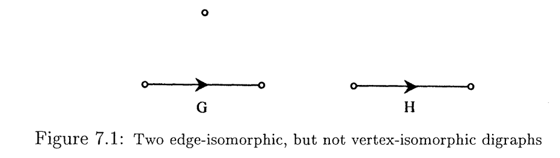
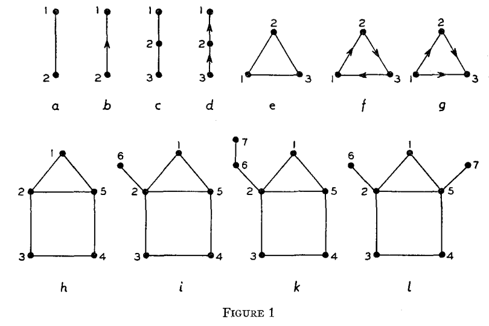
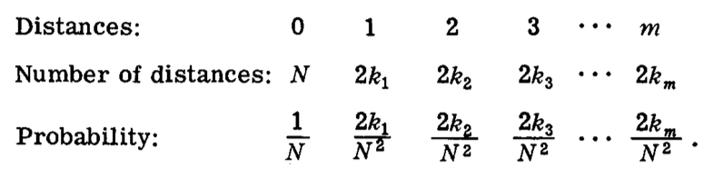
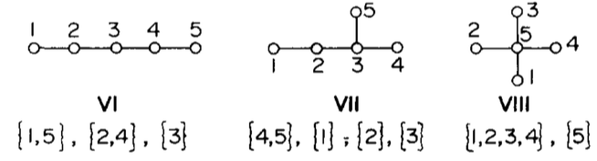
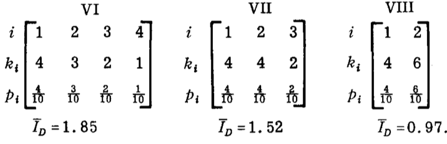

# Notes about graph entropy

## The first entropy measures of graphs

Rashevsky and Trucco in 1995, defined an entropy measure to characterize the structural information content of graphs. His definition is based on the partitioning of the n vertices into k classes of equivalent vertices, according to their degree dependence. Then, assigned a probability to each partition obtained as the fraction of vertices in this partition divided by the total number of vertices. Thus, according to Rashevsky the entropy of a graph $G$ is:

$$ ^{V}I(G) := - \sum_{i=1}^{k} \frac{|N_{i}|}{|V|} log \left( \frac{|N_{i}|}{|V|} \right) $$

According to Rashevsky, $|N_{i}|$ denotes the number of equivalent vertices in the ith class and k the number of classes (or different orbits).

Trucco applied this concept to the edge automorphism group, $Aut*(G)$, introducing a similar entropy measure $^{E}I(G)$. An automorphism of a graph is a permutation of the nodes preserving the adjacency of between nodes. Formally, given a graph X, a permutation $\alpha$ of V(X) is an automorphism of X if for all $u,v \in V(X)$

$$ \left\{u,v\right\} \in E(X) \Leftrightarrow \left\{\alpha(u),\alpha(v)\right\} \in E(X) $$

Quanto mais elementos no conjunto dos grupos automórficos de X, denominado $Aut(X)$ mais simétrico o grafo é.

Um isomorfismo de aresta do grafo $X_{1}$ para $X_{2}$ é uma função bijetora $f: E(X_{1}) \rightarrow E(X_{2})$ onde as arestas $e_{1}$ e $e_{2}$ são incidentes a um vértice de $X_{1}$ se e somente se $f(e_{1})$ e $f(e_{2})$ são incidentes a um vértice em $X_{2}$. Um automorfismo de aresta é um isormorfismo de aresta de um grafo para ele mesmo.

According to Trucco, the entropy measure is:

$$ ^{E}I(G) := - \sum_{i=1}^{k} \frac{|N_{i}^{E}|}{|E|} log \left( \frac{|N_{i}^{E}|}{|E|} \right) $$

Para realizar esse calculo precisamos portanto de identificar as permutações possíveis dos grafos ditos "congruentes" (isomorficos de aresta).

**Exemplo** (grafos extraídos do artigo de Rashevsky)

Seja o grafo L ilustrado na figura 1-l acima. O grupo $Aut*(L)$ contem dois elementos: E=(1)(2)(3)(4)(5)(6)(7) é a permutação identidade e A = (1)(25)(34)(67). Portanto, como o conjunto A contem todos os $n$ vértices de L com o maior número de elementos permutados em L temos:

$$ N_{1} = \{1\}, N_{2}=\{2,5\}, N_{3}=\{3,4\}, N_{4}=\{6,7\} $$

$$ I(L) = - \frac{1}{7} log \frac{1}{7} - \frac{2}{7} log\frac{2}{7} - \frac{2}{7} log\frac{2}{7} - \frac{2}{7} log\frac{2}{7} - \frac{2}{7} log\frac{2}{7} $$

$$ I(L) = \frac{1}{7} log 7 + \frac{6}{7} log \frac{7}{2} $$

Repare que os grafos *b, d, g, i* e *k* mostrados na figura 1 tem entropia $log\ n$ e os grafos ditos transientes, na qual é possível permutar todos os elementos numa única operação, tem entropia igual a 0.

Por exemplo, a entropia de rashevsky do grafo *b* é $H = -\frac{1}{2}\ log\ \frac{1}{2} -\frac{1}{2}\ log\ \frac{1}{2} = log\ 2$.

Como a entropia de Rashevsky e Trucco baseiam-se inteiramente em características invariantes do grafo (graph invariants). Essas características abrangem o número de vértices, nós, conecções, etc. A principal limitação disto é que 2 grafos estruturalmente diferentes podem ter the same information content. Those mesures are so-called degenerate.

To overcome this problem, some measures for graph entropy based on metrical properties were developed.

## Entropy measures based on metrical properties of graphs

Bonchev and Trinajstic developed entropy measures which take into account several structural graph features as distances and vertex degrees.

Given a distance matrix $D$ which has square size (|V|x|V|). The matrix is:

$D = \left(d\left(v_{i}, v_{j}\right)\right)_{ij}$ for $1 \leq i \leq |V|$, $1 \leq j \leq |V|$

The diagonal of the matrix is composed of zeros and is a symmetric matrix. It means that the upper-triangular content is the same as the lower-triangular. Bonchev used the shortest path every pair of connected nodes (the distance $d_{ij}$) to come up with a measure sensitive to branchings in graphs. For a graph with a constant number of nodes, increasing the number of branchings reduces the distances between nodes.

Let the distance of a value $i$ appear $2k_{i}$ times in the distance matrix, where $1 \leq i \leq V-1$, $V$ being the number of vertices. Then $V^{2}$ matrix elements $d_{ij}$ will be partitioned in $m+1$ groups, where $m$ is the highest value of $i$, and $m+1$ will contain $V$ zeros which are the diagonal matrix elements. With each of these $(m+1)$ groups cann be associated a certain probability for a randomly chosen distance $d_{ij}$ to be in the $ith$ group:

$$ p_{i} = \frac{2k_{i}}{V^{2}},\ \ \ \ p_{0} = \frac{V}{V^{2}} = \frac{1}{V} $$

The information content on graphs can be

**(1)** the information content of a given system, $I$, having $N$ elements

$$ I = N\ log\ N - \sum_{i=1}^{n} N_{i}\ log\ N_{i}$$

According to Bonchev it is:

$$ I = V^{2}\ log\ V^{2} - \sum_{i=1}^{m} 2k_{i}\ log\ 2k_{i} $$

or

**(2)** the mean information content of one element of the system will then, $\bar{I}$, be

$\bar{I} = \frac{I}{N} = \sum_{i}^{n} p_{i}\ log\ p_{i}$, where $p_{i} = \frac{N_{i}}{N}$.

Then according to Bonchev:

$$ \bar{I}= - \frac{1}{V} log\ \frac{1}{V} - \sum_{i=1}^{m}  \frac{2k_{i}}{V^2}\ log\ \frac{2k_{i}}{V^2} $$

Lets consider the example given 3 graphs with alternative branchings as depicted in figure.

With the distance matrix $M$ we can obtain the following information on distances:

## Approximate Von Neumann Entropy for directed graphs

Although the way of calculating the graph entropy using partition-based measures i.e., the set of automorphisms and the minimum distance between two nodes seem useful it is not computationally efficient. For larger graphs, it becomes an issue as there is no efficient algorithm to check if there exists an isomorphism for two given graphs and to compute the distance between two nodes can be a tough computer task.

To overcome those issues, Ye et al (2014) extended the calculations of the von Neumann entropy for undirected graphs to directed graphs. And more, they simplified the equations to make them in terms of the nodes in-degree and out-degree. The von Neumann entropy of directed graph is:

$$H_{VN}^{D} = 1 - \frac{1}{|V|} - \frac{1}{2 |V|^{2}} \left\{ \sum_{(u,v) \in E} \frac{d_{u}^{in}}{d_{u}^{in} (d_{u}^{out})^{2}} + \sum_{(u,v) \in E_{2}} \frac{1}{d_{v}^{in} d_{v}^{out}}\right\}$$

Accoring to Ye at al, $E_{2} = \left\{ (u,v) | (u,v) \in E\ and\ (v,u) \in E \right\}$ which means that it is subset of all bidirected-edges. As we plain to calculate entropy of strongly directed graphs, i.e, graphs that has very fewer bidirectional links we can eliminate the second summation in $H_{VN}^{D}$. It gives the approximate entropy for strongly directed graphs as:

$$H_{VN}^{SD} = 1 - \frac{1}{|V|} - \frac{1}{2 |V|^{2}} \sum_{(u,v) \in E} \frac{d_{u}^{in}}{d_{v}^{in} (d_{u}^{out})^{2}} $$

As we can see, the above equation contain two terms. The first is related to the graph size, while the second depends on the degree statistics in the graph. Exploring which topologies give the maximum and minimum entropies it is clearly from equation $H_{VN}^{D}$ that when the term in curly brackets reaches their largest values, the von Neumann entropy takes on its minimum value. This occours when the structure is a circle (*talvez ligar o ultimo e primeiro no de uma sequencia chain linear para torna-la ciclica?*) and each node has only one outgoing link and one ingoing:

$$H_{VN}^{D} = 1 - \frac{1}{|V|} - \frac{1}{2 |V|^{2}} |V| = 1 - \frac{1}{|V|} - \frac{1}{2 |V|} $$

On the other hand, when the terms in the curly brackets take on their smallest value, the entropy is maximum. This occurs in structures of star graphs.

This make sense to us, because when considering bubbles in de Bruijn graphs we increase the von Neumann entropy as oposite to linear chain. *temos que checar se os grafos de bruijn sao irreducible e aperiodics para a aproximacao da entropia de Neumann ser verdadeira devido as condicoes impostas no paper*

We have a primarily interest in evaluate the entropy of graph structures without taking into account the graph size. So the authors proposed a normalization with respect to the graph size removing the size dependence:

$$J_{VN}^{D} = |V| \left| H_{VN}^{D} - \left( 1 - \frac{1}{|V|}\right)\right| = \frac{1}{2|V|} \left\{ \sum_{(u,v) \in E} \frac{d_{u}^{in}}{d_{u}^{in} (d_{u}^{out})^{2}} \right\}$$

Note that the normalizing function $J_{VN}^{D}$ and the $H_{VN}^{D}$ entropy function have opposite monotonicity properties. In other words, when the normalized entropy decreases, the von Neumann entropy increases.
